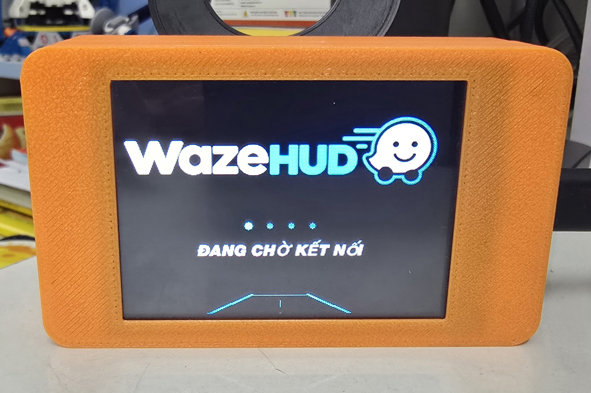

# WazeHUD-CYD-2.8 BLE (bluetooth)

Bắt đầu từ phiên bản này sẽ thay thế cho các phiên bản V1, V2 vì đã tích hợp vào 1 phiên bản này. Phiên bản này chỉ sử dụng giao thức BLE với 3 kiểu hiển thị giao diện. Chuyển đổi giữa các giao diện bằng cách ấn 2 lần trên màn hình hoặc lựa chọn giao diện trong app

